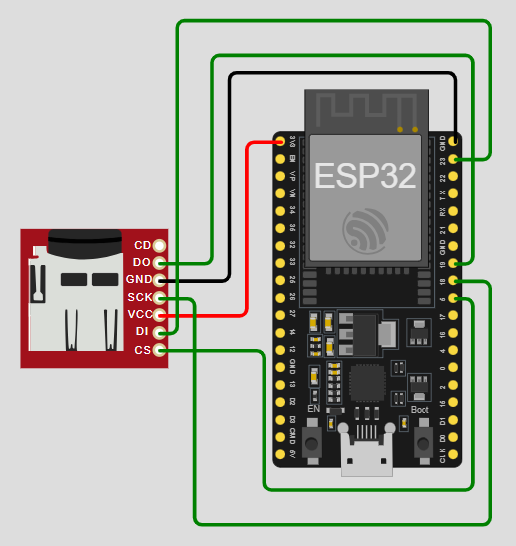

# Sistema de Monitoramento de Água com Detecção de Outliers (ESP32 + SD Card)

Este repositório reúne o código, os dados e a documentação de um sistema de monitoramento de água voltado para a comunidade rural do Riacho, em Amarantina.

Ele é uma **extensão do Projeto de Extensão 1**, no qual foi desenvolvido um protótipo que registra diariamente:

- a **data** da medição  
- a **quantidade de litros bombeados**  
- o **tempo de funcionamento da bomba**

[Vídeo do projeto de extensão 1 no YouTube](https://youtu.be/-hB9_I5IgXk)

[Repositório do projeto de extensão 1 no GitHub](https://github.com/silvagal/sistema_medicao_fluxo_agua)

O problema identificado na etapa anterior foi que, embora as medições fossem registradas diariamente, era **muito difícil para o usuário analisar manualmente** todos os registros em busca de irregularidades, por exemplo:

- dias em que a bomba ficou ligada por muito tempo e quase não bombeou água (falha de sucção, entrada de ar, poço muito baixo etc.)  
- dias em que o volume medido é muito alto para o tempo de funcionamento, indicando possível erro de leitura ou operação atípica

Este projeto responde a essa demanda implementando, em um **ESP32**, um algoritmo de **regressão linear + análise de resíduos** que detecta automaticamente **outliers** (medições anômalas) e apresenta esses alertas de forma interativa via **monitor serial**.

---

## 1. Visão geral do funcionamento

Em resumo, o sistema faz o seguinte:

1. Lê o arquivo `medicoes.txt` gravado no **cartão SD**, contendo:
   - data (`DD/MM/AAAA`)  
   - quantidade de litros (`000123.456789L`)  
   - tempo de funcionamento (`HH:MM:SS`)

2. Converte o tempo para **duração em minutos**.

3. Ajusta uma **reta** (regressão linear) que relaciona:
   - eixo X: duração em minutos  
   - eixo Y: litros bombeados  

4. Para cada medição, calcula o **resíduo**:
   - `residuo = litros_medidos - litros_previstos_pela_reta`

5. Calcula o **valor absoluto** do resíduo e encontra o **percentil 90** desses valores:
   - medições com desvio **abaixo ou igual** a esse limiar → consideradas normais  
   - medições com desvio **acima** desse limiar → marcadas como **outliers**

6. O ESP32 apresenta um **menu no monitor serial**, em que o usuário pode escolher:
   - ver todos os outliers de todo o período  
   - ver apenas os outliers de um ano específico  
   - ver apenas os outliers de um determinado mês/ano

7. Para cada outlier, o sistema mostra um **alerta** com:
   - data  
   - duração de funcionamento  
   - quantidade de litros bombeados  

Dessa forma, o morador não precisa analisar linha por linha, pois o sistema já destaca automaticamente os dias suspeitos.

[Vídeo do projeto de extensão 2 no YouTube](https://youtu.be/W7Dq3uiTRVw)
---

## 2. Estrutura do repositório

Sugestão de organização:

```text
.
├── src/
│   └── main.c               # Código em C (ESP-IDF) com todo o algoritmo
├── dados/
│   └── medicoes.txt         # Arquivo de medições usadas pelo sistema
├── imagens/
│   ├── esquematico.png      # Esquemático do circuito ESP32 + SD card
│   └── grafico_outliers.png # Gráfico tempo x litros com outliers destacados
└── README.md
````

* **`src/main.c`**: código principal do ESP32, escrito no estilo ESP-IDF (`app_main`).
* **`dados/medicoes.txt`**: conjunto de medições em texto, usado tanto no Python (na fase exploratória) quanto no ESP32.
* **`imagens/esquematico.png`**: diagrama de ligações entre ESP32 e módulo de cartão SD.
* **`imagens/grafico_outliers.png`**: gráfico gerado em Python mostrando a reta de regressão e os outliers em destaque.

---

## 3. Materiais utilizados

### 3.1. Hardware

* 1 × **ESP32 DevKit v1**
* 1 × **Módulo de cartão SD** no padrão SPI, com pinos:

  * `VCC`, `GND`, `SCK`, `DO`, `DI`, `CS`, `CD` (opcional)
* 1 × Cartão SD (simulado no Wokwi ou físico)
* Jumpers para conexão

> Observação: neste projeto, o **sensor de vazão real** é abstraído. As medições são lidas a partir de `medicoes.txt`, previamente gerado e gravado no cartão SD.

### 3.2. Software e ambiente

* **ESP-IDF** (framework oficial da Espressif)
* **Wokwi** para simulação do ESP32 + SD card
* **Python** (etapa anterior, para análise e validação dos gráficos)

---

## 4. Esquemático do circuito

Esquemático simplificado das conexões entre o ESP32 e o módulo SD:

```text
ESP32 DevKit v1           Módulo SD (SPI)
-----------------         ----------------
3V3                  ->   VCC
GND                  ->   GND
GPIO18               ->   SCK
GPIO19               ->   DO (MISO)
GPIO23               ->   DI (MOSI)
GPIO5                ->   CS
CD                   ->   (não conectado)
```




---

## 5. Técnica de detecção de anomalias

### 5.1. Por que usar uma linha reta?

Antes de levar o algoritmo para o ESP32, as medições foram analisadas no Python.
Foi gerado um gráfico com:

* eixo X: **tempo de bombeamento (em minutos)**
* eixo Y: **litros bombeados em cada dia**

Visualmente, os pontos formavam uma **tendência aproximadamente linear**. Isso faz sentido também do ponto de vista teórico: se a bomba opera com uma vazão aproximadamente constante (litros por minuto), então **quanto maior o tempo de funcionamento, maior deve ser o volume total bombeado**. Em termos simples, se a bomba fica ligada o dobro do tempo, espera-se que bombeie aproximadamente o dobro de litros.

Por esse motivo, faz sentido ajustar uma **reta** que represente o comportamento esperado do sistema.

### 5.2. Regressão linear

O ESP32 ajusta uma reta do tipo:

[
\text{litros} \approx a \cdot \text{duracao_min} + b
]

onde:

* `duracao_min` é o tempo de funcionamento em minutos
* `litros` é o volume bombeado
* `a` é o coeficiente angular (litros por minuto)
* `b` é o intercepto

O cálculo segue as fórmulas clássicas de regressão linear simples:

* cálculo das médias de X (duração) e Y (litros)
* cálculo de `s_xx` e `s_xy`
* `a = s_xy / s_xx`
* `b = meanY - a * meanX`

Tudo isso é implementado diretamente no código C do ESP32.

### 5.3. Cálculo do resíduo

Para cada medição, o algoritmo faz:

1. Calcula o valor previsto pela reta:

   * `litros_previstos = a * duracao_min + b`
2. Calcula o **resíduo**:

   * `residuo = litros_medidos - litros_previstos`
3. Calcula o **valor absoluto**:

   * `abs_residuo = |residuo|`, que indica o quão distante o ponto está da linha ideal, sem considerar se o valor medido ficou acima ou abaixo da reta.

### 5.4. Uso do percentil 90 para definir outliers

Todos os valores `abs_residuo` são reunidos e ordenados.
Em seguida, o código encontra o **percentil 90**, isto é, um valor de corte tal que cerca de 90% das medições tenham um desvio **menor ou igual** a ele.

* Se `abs_residuo` da medição **é menor ou igual** ao limiar → medição considerada **normal**
* Se `abs_residuo` **é maior** que o limiar → medição marcada como **outlier**

Dessa forma, apenas as medições com desvios mais extremos, aproximadamente 10% dos pontos, são tratadas como anomalias.

### 5.5. Visualização gráfica (Python)

No Python, foi gerado um gráfico semelhante a este (o notebook utilizado para gerar esse gráfico está na pasta notebooks deste repositório):


* Pontos azuis: medições normais
* Pontos vermelhos: outliers
* Linha tracejada: reta da regressão (comportamento esperado)

Esse gráfico ajudou a validar que a técnica realmente destacava:

* dias de muito tempo de funcionamento com pouco volume (falhas de sucção, entrada de ar)
* dias de volume muito alto para um tempo curto (comportamentos anormais ou leituras incorretas)

---

## 6. Funcionamento do programa no ESP32

### 6.1. Fluxo geral

1. **Montagem do SD card**
   O ESP32 inicializa o barramento SPI e monta o cartão SD em `/sdcard`.

2. **Leitura do arquivo `medicoes.txt`**
   Cada linha é interpretada como:

   ```txt
   DD/MM/AAAA LITROS L HH:MM:SS
   ```

   A data é quebrada em dia, mês e ano, os litros são convertidos para `float` (removendo o `L` do final) e o tempo é convertido para segundos e depois para minutos.

3. **Cálculo da regressão**

   * somatórios de X (tempo) e Y (litros)
   * cálculo das médias, `s_xx`, `s_xy`
   * cálculo de `a` (inclinação) e `b` (intercepto)

4. **Cálculo de resíduos e limiar**

   * para cada medição, calcula `litros_previstos` e o resíduo
   * armazena `abs_residuo`
   * ordena esses valores e pega o percentil 90
   * marca como `outlier` os registros com `abs_residuo` acima do limiar

5. **Menu no monitor serial**
   O ESP32 apresenta um menu com três opções:

   * `1`: ver todos os outliers de todo o período
   * `2`: ver apenas outliers de um ano específico
   * `3`: ver apenas outliers de um mês/ano específico

6. **Emissão de alertas**
   Para cada outlier filtrado de acordo com a opção escolhida, o ESP32 imprime na serial:

   ```txt
   [ALERTA] Dia: DD/MM/AAAA | Duração: HH:MM:SS | Litros: XXX.XX L
   ```

---

## 7. Explicação das principais funções do código (`main.c`)

Abaixo, um resumo das funções mais importantes do código em C (ESP-IDF):

### `void app_main(void)`

Função principal no ESP-IDF.
Responsável por:

* imprimir a mensagem inicial
* chamar `init_sdcard()` para montar o cartão SD
* chamar `load_and_process_file()` para ler as medições e calcular a regressão e os outliers
* entrar em um loop infinito exibindo o menu e processando as opções digitadas pelo usuário
* chamar as funções de listagem de outliers conforme a opção escolhida

---

### `static esp_err_t init_sdcard(void)`

Responsável por:

* configurar o host SDSPI (SPI + SDMMC)
* configurar o barramento SPI com os pinos:

  * MOSI = GPIO23
  * MISO = GPIO19
  * SCK  = GPIO18
  * CS   = GPIO5
* chamar `esp_vfs_fat_sdspi_mount` para montar o SD em `/sdcard`
* imprimir informações do cartão SD no terminal

Se algo falha, exibe mensagens de erro e interrompe o programa.

---

### `static void load_and_process_file(void)`

Responsável por:

1. Abrir o arquivo `/sdcard/medicoes.txt` para leitura.
2. Ler linha a linha e extrair:

   * `dateStr` (DD/MM/AAAA)
   * `litrosStr` (xxxxxL)
   * `tempoStr` (HH:MM:SS)
3. Converter:

   * data em dia, mês e ano
   * litros em `float` (removendo o `L` final)
   * tempo em horas, minutos e segundos, depois em minutos
4. Armazenar nos arrays globais `gDay`, `gMonth`, `gYear`, `gLitros`, `gDuracaoMin`, `gTempoStr`
5. Após carregar tudo:

   * calcular somatórios, médias, `s_xx`, `s_xy`
   * calcular `gSlope` (a) e `gIntercept` (b)
   * calcular `gResid` e `gAbsResid` para cada registro
   * calcular o percentil 90 dos `gAbsResid` e armazenar em `gThrAbsResid`
   * preencher `gIsOutlier[i]` com 0 (normal) ou 1 (outlier)

---

### `static int read_int_from_stdin(const char *prompt)`

Função auxiliar que:

* imprime um texto de prompt (por exemplo `"Opcao: "`)
* espera o usuário digitar algo no monitor serial
* converte a string digitada para inteiro
* retorna esse valor

É usada para ler:

* a opção do menu
* o ano desejado
* o mês desejado

---

### `static void print_alert(int i)`

Recebe o índice `i` de uma medição e:

* monta a data no formato `DD/MM/AAAA`
* imprime na serial um alerta:

  ```txt
  [ALERTA] Dia: DD/MM/AAAA | Duração: HH:MM:SS | Litros: XXX.XX L
  ```

É usada pelas funções que listam outliers.

---

### `static void show_outliers_all(void)`

* Percorre todos os registros
* para cada índice `i` em que `gIsOutlier[i] == 1`, chama `print_alert(i)`
* se nenhum outlier é encontrado, exibe uma mensagem dizendo que não há outliers no período

---

### `static void show_outliers_year(int year)`

* Percorre todos os registros
* seleciona aqueles com `gIsOutlier[i] == 1` e `gYear[i] == year`
* imprime os alertas correspondentes
* se nada é encontrado, informa que não há outliers naquele ano

---

### `static void show_outliers_month_year(int month, int year)`

* Percorre os registros
* seleciona aqueles com `gIsOutlier[i] == 1`, `gYear[i] == year` e `gMonth[i] == month`
* imprime os alertas correspondentes
* se não há resultados, informa que não existem outliers naquele mês/ano

---

### `static void print_menu(void)`

* Imprime o menu de opções na serial:

  ```txt
  ===== MENU DE OUTLIERS =====
  1 - Ver outliers de TODO o período
  2 - Ver outliers por ANO
  3 - Ver outliers por MES/ANO
  ============================
  ```

---

## 8. Como rodar o projeto

### 8.1. Preparando o arquivo de medições

Certifique-se de que:

* o arquivo `medicoes.txt` está em `dados/medicoes.txt` neste repositório
* na simulação (Wokwi) ou no hardware real, esse arquivo é copiado para a **raiz do cartão SD**

Formato esperado de cada linha:

```txt
DD/MM/AAAA 000123.456789L HH:MM:SS
```

### 8.2. Rodando com ESP-IDF em hardware real

1. Instale o **ESP-IDF** (ver documentação oficial da Espressif).

2. Copie o conteúdo de `src/main.c` para o projeto ESP-IDF.

3. Ajuste `CMakeLists.txt` ou `component.mk`, se necessário.

4. Conecte o **ESP32 DevKit v1** ao módulo SD seguindo o esquemático.

5. Grave `medicoes.txt` no cartão SD físico.

6. Compile e grave o firmware:

   ```bash
   idf.py build
   idf.py flash monitor
   ```

7. No monitor serial, acompanhe as mensagens de inicialização e o resumo da regressão.

8. Quando o menu aparecer, digite `1`, `2` ou `3` e pressione Enter para visualizar os outliers.

### 8.3. Rodando no Wokwi

1. Crie um projeto ESP32 com ESP-IDF no Wokwi.
2. Substitua o `main.c` pelo conteúdo de `src/main.c`.
3. Adicione um módulo **SD Card** e conecte:

   * ESP32 3V3 → VCC
   * ESP32 GND → GND
   * ESP32 GPIO18 → SCK
   * ESP32 GPIO19 → DO
   * ESP32 GPIO23 → DI
   * ESP32 GPIO5  → CS
4. Adicione o arquivo `medicoes.txt` na configuração do SD card virtual (raiz do cartão).
5. Execute a simulação e abra o monitor serial.
6. Use o menu da mesma forma que no hardware real.

---

## 9. Trabalhos futuros

* Conectar o sistema a um **sensor de vazão físico**, substituindo as medições simuladas do arquivo por leituras em tempo real
* Utilizar o **Wi-Fi do ESP32** para enviar alertas para um servidor web ou para um aplicativo móvel, permitindo notificações remotas
* Criar uma interface web para visualizar gráficos de consumo e histórico de outliers
* Explorar técnicas mais robustas de regressão e detecção de outliers, como regressão robusta (RANSAC) ou modelos não lineares

---

Este projeto foi desenvolvido como parte de um **projeto de extensão em Ciência da Computação**, aplicado à realidade de uma comunidade rural que depende de poços artesianos e córregos para seu abastecimento de água, buscando oferecer uma ferramenta acessível de monitoramento e apoio à tomada de decisão.
